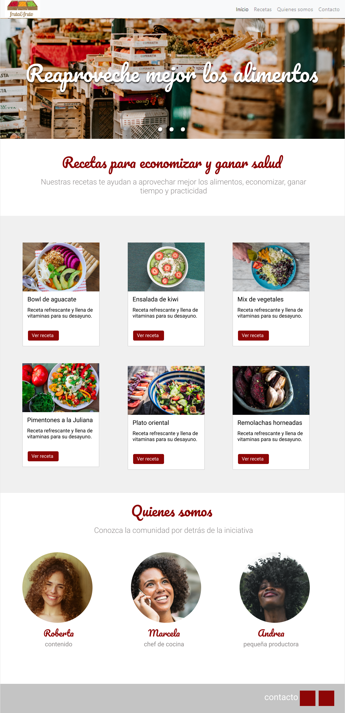

# Página web de recetas
Diseño realizado como aprendizaje en el curso de arquitectura de CSS dictado por Alura para el programa educativo **ONE** de Oracle.

## Sitio Web
Si queres ver mi sito ingresa al siguiente link https://camilamaturano00.github.io/Recetas/ donde probaras el resultado obtenido.
Prototipo: https://www.figma.com/file/ZIZuMVCGh6cE3UQvTbFsuj/alura-bootstrap?node-id=0%3A1
